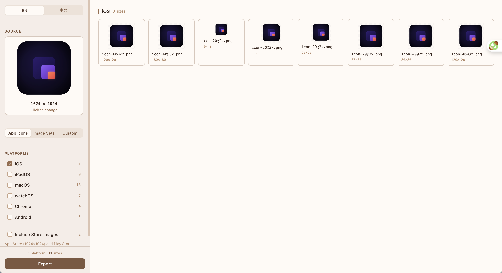

# Icon Sizes

Local desktop app that turns one PNG into app icons for iOS, macOS, Android, Chrome, and more. Free, MIT, no uploads.

[](https://github.com/EvilIrving/app-icon-sizes/releases/latest)
[](LICENSE)

**[Website](https://evilirving.github.io/app-icon-sizes/)** · **[Download](https://github.com/EvilIrving/app-icon-sizes/releases/latest)** · **[中文说明](README.zh-CN.md)** · **[中文站点](https://evilirving.github.io/app-icon-sizes/zh/)**

<!-- Screenshot placeholder: replace en.png and add a short demo GIF before a public launch. -->


## What it is

Icon Sizes is for indie and mobile developers who need Asset Catalog / mipmap-ready icon sets without sending artwork to a website. Drop in a 1024×1024 PNG, pick platforms, export one ZIP. Processing stays on your machine (Tauri desktop app).

## Features

- **Local-first**: resize and ZIP export on-device; nothing is uploaded
- **Apple presets**: iPhone, iPad, macOS, and watchOS app icon sizes
- **Android**: mdpi through xxxhdpi launcher icons (`ic_launcher` or custom name)
- **Image sets**: 1x/2x/3x or 1x/2x/3x/4x, with `Contents.json` for iOS asset catalogs
- **Chrome extension**: 16 / 32 / 48 / 128
- **Favicon and store images**: additional export modes in the app
- **iOS Asset Catalog export**: App Icon / Image Set oriented output where configured
- **EN / 中文 UI**

## Install

### Download (recommended)

Grab the latest binary from [GitHub Releases](https://github.com/EvilIrving/app-icon-sizes/releases/latest):

| Platform | Artifact |
|---|---|
| macOS (Apple Silicon) | `.dmg` |
| Windows | `.msi` or NSIS `.exe` |

> **macOS note (temporary):** Developer ID + notarization is prepared in CI but not verified on a clean Mac yet. If Gatekeeper blocks the app, clear quarantine once:
> ```bash
> xattr -rd com.apple.quarantine "/Applications/Icon Sizes.app"
> ```

### Build from source

Needs Node.js 18+, pnpm, Rust ([rustup](https://rustup.rs)), plus Xcode CLT (macOS) or VS Build Tools (Windows).

```bash
pnpm install
pnpm tauri dev    # development
pnpm tauri build  # production installers
```

Installers land under `src-tauri/target/release/bundle/`.

## How to use

1. Open the app (dev build or release binary)
2. Drop a source PNG (1024×1024 works best)
3. Select platforms in the sidebar
4. Adjust options (Android filename, image-set scale, and so on)
5. Preview in the grid, then export a ZIP

## Project layout

```
src/           React UI, presets, resize, ZIP export
src-tauri/     Tauri shell
docs/          GitHub Pages landing site (EN + 中文)
```

Stack: React 18 + TypeScript + Vite, Tauri 2, Canvas resize (pica), JSZip.

## License

[MIT](LICENSE)
