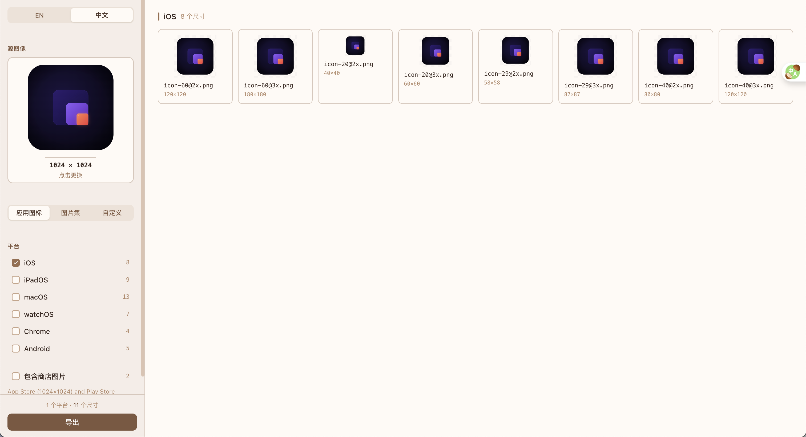

# Icon Sizes

一款桌面应用，从单张源图片生成多平台的应用图标。基于 Tauri、React 和 TypeScript 构建。

**[🇺🇸 English Version](README.md)**

## 功能

拖入一张 1024×1024 的 PNG 图片，选择目标平台，就能拿到包含所有所需尺寸的 ZIP 包。没有网络服务，不用把图片上传到不可信的网站——所有操作都在本地完成。

**支持的输出：**
- iOS 和 macOS 应用图标（43 种尺寸，覆盖 iPhone、iPad、watchOS、macOS）
- Android 启动器图标（mdpi 到 xxxhdpi）
- 图片集，支持 1x/2x/3x 或 1x/2x/3x/4x 缩放
- Chrome 扩展图标



## 平台详情

### iOS 和 macOS

生成完整的 43 种图标尺寸：

**iPhone** – 8 种尺寸，包括应用图标（60pt @2x/@3x）、通知（20pt）、设置（29pt）、聚焦搜索（40pt）

**iPad** – 9 种尺寸，覆盖标准 iPad、iPad Pro（83.5pt @2x），以及与 iPhone 相同的辅助尺寸

**watchOS** – 7 种尺寸，用于 Apple Watch 复杂功能和 1024pt App Store 图标

**macOS** – 11 种尺寸，从 16pt 到 1024pt

### Android

导出到标准的 mipmap 文件夹：
- mipmap-mdpi (48×48)
- mipmap-hdpi (72×72)
- mipmap-xhdpi (96×96)
- mipmap-xxhdpi (144×144)
- mipmap-xxxhdpi (192×192)

可以自定义文件名（默认：`ic_launcher`）。

### 图片集

用于 iOS 资源目录或 Android drawable 资源。选择 3x 缩放（base、@2x、@3x）或 4x 缩放（额外增加 @4x）。iOS 版本包含 Contents.json 文件。文件名可自定义。

### Chrome 扩展

四种尺寸：16×16、32×32、48×48、128×128

## 快速开始

你需要：
- Node.js 18+ 和 pnpm
- Rust（用于 Tauri 构建）– 从 [rustup.rs](https://rustup.rs) 安装
- Xcode 命令行工具（macOS）或 Visual Studio Build Tools（Windows）

```bash
# 安装依赖
pnpm install

# 开发模式运行
pnpm tauri dev

# 构建生产版本
pnpm tauri build
```

## 代码结构

```
icon-sizes/
├── src/                      # 前端
│   ├── core/
│   │   ├── presets.ts        # 平台配置
│   │   ├── resize.ts         # 图片缩放
│   │   └── exporter.ts       # ZIP 生成
│   ├── components/           # UI 组件
│   ├── App.tsx               # 主应用
│   └── App.css
├── src-tauri/                # Tauri 后端
│   ├── src/
│   │   └── main.rs
│   ├── tauri.conf.json
│   └── Cargo.toml
├── package.json
└── vite.config.ts
```

## 使用指南

1. 运行 `pnpm tauri dev` 或直接打开构建好的应用
2. 将源图片拖入上传区域（推荐 1024×1024 PNG）
3. 在侧边栏选择平台
4. 调整选项：
   - Android：设置自定义文件名
   - 图片集：选择 3x 或 4x 缩放，设置文件名
5. 在主区域预览生成的图标
6. 点击导出，选择 ZIP 保存位置

## 技术栈

- React 18 + TypeScript + Vite 构建界面
- Tauri 2.x 桌面封装
- Canvas API 进行图片缩放（使用高质量平滑算法）
- JSZip 生成 ZIP 文件
- Tauri Dialog 和 FS 插件处理文件操作

## 构建发布版本

### macOS
```bash
pnpm tauri build --target aarch64-apple-darwin  # Apple Silicon
pnpm tauri build --target x86_64-apple-darwin   # Intel
```

### Windows
```bash
pnpm tauri build --target x86_64-pc-windows-msvc
```

构建好的安装包在 `src-tauri/target/release/bundle/` 目录中。

## 许可证

MIT
