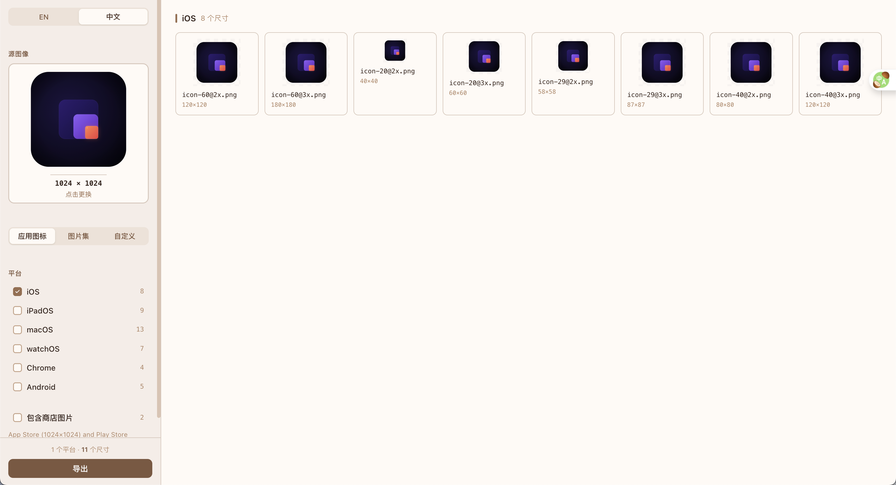

# Icon Sizes

**一张 PNG 进去，各平台图标尺寸出来。**

本地桌面应用，覆盖 iOS、macOS、Android、Chrome 等。免费、MIT、不上传。

[](https://github.com/EvilIrving/app-icon-sizes/releases/latest)
[](LICENSE)

**[网站](https://evilirving.github.io/app-icon-sizes/zh/)** · **[下载](https://github.com/EvilIrving/app-icon-sizes/releases/latest)** · **[English](README.md)** · **[English site](https://evilirving.github.io/app-icon-sizes/)**

<!-- 截图占位：对外宣传前请替换 zh.png，并补一张短演示 GIF。 -->


## 这是什么

面向不想把设计稿上传到陌生网站、又需要 Asset Catalog / mipmap 结构的独立开发者与移动端开发者。拖入 1024×1024 PNG，勾选平台，导出一个 ZIP。处理全程在本地（Tauri 桌面应用）。

## 功能

- **本地优先**：本机缩放与 ZIP 导出，不上传
- **Apple 预设**：iPhone、iPad、macOS、watchOS 应用图标尺寸
- **Android**：mdpi 到 xxxhdpi 启动图标（默认 `ic_launcher`，可改名）
- **图片集**：1x/2x/3x 或 1x/2x/3x/4x，并带 iOS 用的 `Contents.json`
- **Chrome 扩展**：16 / 32 / 48 / 128
- **Favicon 与商店图**：应用内另有对应导出模式
- **iOS Asset Catalog 导出**：按配置输出 App Icon / Image Set 结构
- **中英界面**

## 安装

### 下载（推荐）

从 [GitHub Releases](https://github.com/EvilIrving/app-icon-sizes/releases/latest) 获取安装包：

| 平台 | 产物 |
|---|---|
| macOS（Apple Silicon） | `.dmg` |
| Windows | `.msi` 或 NSIS `.exe` |

> **macOS：** DMG 和其中的 App 均使用 Developer ID 签名并完成 Apple 公证；CI 会在发布前验证两层公证票据与 Gatekeeper 状态。

### 源码构建

需要 Node.js 18+、pnpm、Rust（[rustup](https://rustup.rs)），以及 macOS 的 Xcode 命令行工具或 Windows 的 VS Build Tools。

```bash
pnpm install
pnpm tauri dev    # 开发
pnpm tauri build  # 生产安装包
```

安装包在 `src-tauri/target/release/bundle/`。

## 使用

1. 打开应用（开发构建或 Release 安装包）
2. 拖入源 PNG（推荐 1024×1024）
3. 在侧边栏选择平台
4. 按需调整选项（Android 文件名、图片集缩放等）
5. 预览后导出 ZIP

## 目录结构

```
src/           React 界面、预设、缩放、ZIP 导出
src-tauri/     Tauri 壳
docs/          GitHub Pages 落地页（中英）
```

技术栈：React 18 + TypeScript + Vite、Tauri 2、Canvas 缩放（pica）、JSZip。

## 参与贡献

开发与 PR 约定见 [CONTRIBUTING.md](CONTRIBUTING.md)。安全问题请看 [SECURITY.md](SECURITY.md)。

如果这个工具对你有用，点个 GitHub Star 能让更多人发现它。

## 许可证

[MIT](LICENSE)
